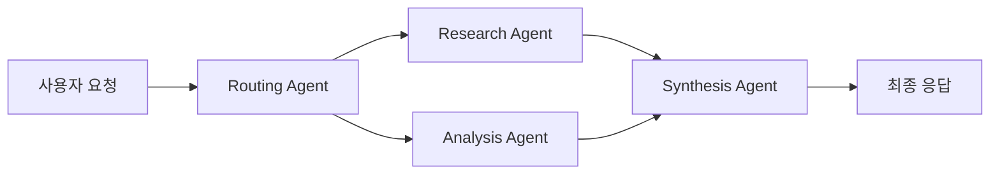

# Spring AI Developer Hub 웹사이트 기획서

## 1. 프로젝트 개요

### 1.1 목적
Spring AI 개발자들이 프로젝트 개발 시 필요한 핵심 정보와 실무 도구를 제공하는 무료 개발자 허브

### 1.2 핵심 가치 제안
- **핵심 정보 집약**: 복잡한 문서 대신 필수 정보만 선별 제공
- **빠른 시작**: 5분 내 실행 가능한 실무 예제 중심
- **개발자 친화적**: 코드 우선, 이론 최소화
- **오픈소스 정신**: 무료 제공, 커뮤니티 기여 기반

## 2. 타겟 사용자

### 2.1 Primary 사용자
- Spring AI를 활용한 엔터프라이즈 애플리케이션 개발자
- AI 에이전트 시스템을 구축하는 아키텍트
- RAG 애플리케이션을 개발하는 데이터 엔지니어

### 2.2 Secondary 사용자
- Spring AI 학습자 및 연구자
- AI 스타트업 개발팀
- Spring 생태계 기여자

## 3. 핵심 기능

### 3.1 빠른 시작 가이드

#### 3.1.1 주요 프로바이더 설정 (5분 설정)
```yaml
# application.yml - 복사 붙여넣기 즉시 사용
spring:
  ai:
    openai:
      api-key: ${OPENAI_API_KEY}
      chat:
        options:
          model: gpt-4o
          temperature: 0.7
```

### 3.2 필수 코드 템플릿

#### 3.2.1 RAG 시스템 (5분 구현)
```java
@Service
public class SimpleRAGService {
    private final ChatClient chatClient;
    private final VectorStore vectorStore;
    
    public String askQuestion(String question) {
        // 1. 관련 문서 검색
        List<Document> docs = vectorStore.similaritySearch(question);
        
        // 2. 컨텍스트와 함께 질문
        return chatClient.prompt()
            .user(u -> u.text(question).param("context", docs))
            .call()
            .content();
    }
}
```

#### 3.2.2 벡터 스토어 선택 (용도별)
| 용도 | 추천 | 설정 |
|-----|------|------|
| 로컬 개발 | Chroma | `@EnableChroma` |
| 기존 PostgreSQL | PGVector | `spring.ai.vectorstore.pgvector` |
| 클라우드 | Pinecone | `spring.ai.vectorstore.pinecone` |

### 3.3 코드 생성기 및 템플릿

#### 3.3.1 ChatClient 설정 생성기
```java
// 사용자 선택: OpenAI + 스트리밍 + Tool Calling
@Service
public class AIChatService {
    
    private final ChatClient chatClient;
    
    public AIChatService(ChatClient.Builder builder) {
        this.chatClient = builder
            .defaultOptions(OpenAiChatOptions.builder()
                .withModel(OpenAiApi.ChatModel.GPT_4_O)
                .withTemperature(0.7f)
                .build())
            .defaultFunctions("getCurrentWeather")
            .build();
    }
    
    public Flux<String> streamChat(String message) {
        return chatClient.prompt()
            .user(message)
            .stream()
            .content();
    }
}
```

#### 3.3.2 RAG 애플리케이션 템플릿
- 문서 임베딩 파이프라인
- 검색 최적화 설정
- 하이브리드 검색 (키워드 + 벡터) 구현

#### 3.3.3 에이전트 시스템 부트스트랩
```java
// 멀티 에이전트 오케스트레이션 템플릿
@Component
public class AgentOrchestrator {
    
    @Autowired
    private ResearchAgent researchAgent;
    
    @Autowired
    private WritingAgent writingAgent;
    
    @Autowired
    private ReviewAgent reviewAgent;
    
    public AgentResponse processTask(TaskRequest request) {
        // Chain workflow implementation
        ResearchResult research = researchAgent.investigate(request);
        WritingResult draft = writingAgent.compose(research);
        return reviewAgent.finalize(draft);
    }
}
```

### 3.4 아키텍처 패턴 라이브러리

#### 3.4.1 대화형 다이어그램
- **Chain Workflow**: 순차적 태스크 처리 패턴
- **Parallelization**: 병렬 처리 패턴  
- **Routing**: 지능형 태스크 분배 패턴
- **Multi-agent**: 다중 에이전트 협업 패턴

#### 3.4.2 실시간 플로우 시뮬레이터


### 3.5 실시간 테스팅 환경

#### 3.5.1 AI 모델 플레이그라운드
- 다양한 모델을 브라우저에서 직접 테스트
- 프롬프트 최적화 도구
- 응답 품질 비교 분석

#### 3.5.2 벡터 검색 시뮬레이터
- 실제 문서를 업로드하여 RAG 테스트
- 유사도 임계값 조정 및 결과 확인
- 검색 성능 최적화 가이드

### 3.6 모니터링 및 관찰가능성

#### 3.6.1 메트릭 대시보드 템플릿
```yaml
# Grafana 대시보드 자동 생성
panels:
  - title: "토큰 사용량 추이"
    query: "rate(gen_ai_client_token_usage_total[5m])"
  - title: "응답 시간 분포"
    query: "histogram_quantile(0.95, gen_ai_client_operation_duration_seconds_bucket)"
  - title: "에러율"
    query: "rate(gen_ai_client_operation_errors_total[5m])"
```

#### 3.6.2 알림 규칙 생성기
- 비용 임계값 초과 알림
- 성능 저하 감지
- 에러율 증가 모니터링

### 3.7 커뮤니티 및 학습 리소스

#### 3.7.1 실사용 사례 갤러리
- **고객 지원 봇**: 다국어 지원, 감정 분석 포함
- **문서 분석 시스템**: PDF, 이미지 OCR, 테이블 추출
- **코드 리뷰 어시스턴트**: GitHub 통합, 자동 PR 리뷰

#### 3.7.2 베스트 프랙티스 위키
- 프롬프트 엔지니어링 가이드
- 성능 최적화 체크리스트
- 보안 및 컴플라이언스 가이드

#### 3.7.3 문제 해결 Q&A
- 자주 발생하는 이슈와 해결책
- 커뮤니티 기반 문답
- 전문가 검증된 솔루션

## 4. 기술 아키텍처

### 4.1 Frontend
- **Next.js 14**: App Router, Server Components
- **TypeScript**: 타입 안전성
- **Tailwind CSS**: 유틸리티 퍼스트 스타일링
- **Shadcn/ui**: 일관된 컴포넌트 디자인
- **Mermaid.js**: 다이어그램 렌더링

### 4.2 Backend
- **Spring Boot 3.3+**: 메인 애플리케이션 서버
- **Spring AI 1.0.0 GA**: AI 통합 레이어
- **PostgreSQL**: 메타데이터 및 사용자 데이터
- **Redis**: 캐싱 및 세션 관리
- **Chroma**: 문서 임베딩 저장소

### 4.3 DevOps
- **Docker**: 컨테이너화
- **Kubernetes**: 오케스트레이션
- **GitHub Actions**: CI/CD
- **Prometheus + Grafana**: 모니터링

## 5. 주요 화면 구성

### 5.1 메인 대시보드
```
┌─────────────────────────────────────────────────────────┐
│ Spring AI Developer Hub                    [로그인]      │
├─────────────────────────────────────────────────────────┤
│                                                         │
│  🚀 빠른 시작                                            │
│  ┌─────────────┐ ┌─────────────┐ ┌─────────────┐       │
│  │ 모델 선택기  │ │ 벡터DB 가이드│ │ 템플릿 생성  │       │
│  └─────────────┘ └─────────────┘ └─────────────┘       │
│                                                         │
│  📊 실시간 통계                                          │
│  • 지원 모델: 20+    • 벡터DB: 18+    • 활성 사용자: 1.2K │
│                                                         │
│  🔥 인기 리소스                                          │
│  1. ChatClient 설정 가이드                               │
│  2. RAG 애플리케이션 템플릿                              │
│  3. 에이전트 오케스트레이션 패턴                          │
│                                                         │
│  📺 최근 업데이트                                        │
│  • Spring AI 1.0.0 GA 새로운 기능                       │
│  • OpenAI o3 모델 통합 가이드                           │
│                                                         │
└─────────────────────────────────────────────────────────┘
```


## 6. 콘텐츠 전략

### 6.1 콘텐츠 카테고리
1. **시작 가이드**: 5분 내 실행 가능한 예제
2. **패턴 라이브러리**: 검증된 아키텍처 패턴
3. **성능 가이드**: 최적화 및 스케일링
4. **보안 가이드**: 엔터프라이즈 보안 모범 사례
5. **마이그레이션**: 기존 시스템에서 Spring AI로

### 6.2 콘텐츠 업데이트 주기
- **주간**: 새로운 모델 지원, 버그 수정
- **월간**: 새로운 패턴, 사용 사례 추가
- **분기**: 주요 Spring AI 버전 업데이트 반영

## 7. 개발자 중심 운영

### 7.1 완전 무료 제공
- 모든 가이드 및 템플릿 무료 제공
- 오픈소스 정신에 기반한 무료 서비스
- 광고 없는 깔끔한 개발자 경험

### 7.2 커뮤니티 기반 운영
- GitHub 기반 콘텐츠 관리
- 개발자 커뮤니티 기여 환영
- 이슈 및 PR을 통한 개선

### 7.3 지속 가능성
- 오픈소스 프로젝트로 운영
- 커뮤니티 멘테이너 모집
- Spring 생태계 기여를 통한 가치 창출

## 8. 성공 지표 (개발자 중심)

### 8.1 사용성 지표
- **문제 해결 시간**: 평균 5분 내 해답 발견
- **코드 복사율**: 방문자의 70% 이상이 코드 복사
- **재방문율**: 개발자의 40% 이상이 재방문

### 8.2 커뮤니티 지표
- **GitHub 스타**: Spring AI 생태계 성장 기여
- **커뮤니티 기여**: 월 50+ 이슈/PR
- **개발자 피드백**: 긍정적 피드백 90% 이상

### 8.3 콘텐츠 품질 지표
- **코드 정확성**: 99% 이상 실행 가능한 예제
- **문서 최신성**: Spring AI 릴리스 후 1주일 내 업데이트
- **사용자 만족도**: 5점 만점에 4.5점 이상


## 9. 결론

Spring AI Developer Hub는 복잡한 AI 생태계를 단순화하여 개발자가 빠르게 생산성을 높일 수 있도록 돕는 **무료 개발자 리소스**입니다. 

### 핵심 철학
- **개발자 우선**: 이론보다 실무, 설명보다 코드
- **시간 절약**: 5분 내 문제 해결, 즉시 사용 가능한 템플릿  
- **오픈소스**: 무료 제공, 커뮤니티 기여 환영
- **품질 중심**: 검증된 패턴과 모범 사례만 선별

이를 통해 Spring AI 생태계의 진입 장벽을 낮추고, 개발자가 AI 기능에 집중할 수 있는 환경을 만들어 나갈 것입니다.